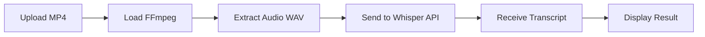

<div align="center">

# 🎬 MP4 to Text Transcriber

### *Powered by Whisper AI & FFmpeg*


</div>

---

## 📋 Table of Contents

- [✨ Features](#-features)
- [🎯 Demo](#-demo)
- [🚀 Quick Start](#-quick-start)
- [📦 Installation](#-installation)
- [💻 Usage](#-usage)
- [🏗️ Project Structure](#️-project-structure)
- [🔧 Technologies Used](#-technologies-used)
- [⚙️ How It Works](#️-how-it-works)
- [🤝 Contributing](#-contributing)
- [📞 Contact](#-contact)
- [📄 License](#-license)

---

## ✨ Features

<div align="center">

| Feature | Description |
|---------|-------------|
| 🎥 **Video Processing** | Extract audio from MP4 videos instantly |
| 🎙️ **AI Transcription** | Convert speech to text using OpenAI's Whisper |
| ⚡ **Browser-Based** | No server required - runs entirely in your browser |
| 🎨 **Clean UI** | Simple and intuitive user interface |
| 🔒 **Privacy First** | Process files locally before API call |
| 📱 **Responsive** | Works on desktop and mobile devices |

</div>

---

## 🎯 Demo

<div align="center">

### 🎬 Upload → 🎧 Extract → 📝 Transcribe

```
┌─────────────┐      ┌─────────────┐      ┌─────────────┐
│   Upload    │ ───▶ │   Extract   │ ───▶ │ Transcribe  │
│   MP4 File  │      │    Audio    │      │  with AI    │
└─────────────┘      └─────────────┘      └─────────────┘
```

</div>

---

## 🚀 Quick Start

```bash
# Clone the repository
git clone https://github.com/deepakrajjs-29/mp4-to-text-transcriber.git

# Navigate to project directory
cd mp4-to-text-transcriber

# Open in browser
open index.html
```

**Or simply download the files and open `index.html` in your browser!**

---

## 📦 Installation

### Prerequisites

- Modern web browser (Chrome, Firefox, Safari, Edge)
- Internet connection (for FFmpeg and Whisper API)

### Setup

1. **Download or clone this repository**
   ```bash
   git clone https://github.com/deepakrajjs-29/mp4-to-text-transcriber.git
   ```

2. **No dependencies to install!** 
   
   The project uses CDN links for:
   - FFmpeg.wasm (video processing)
   - Hugging Face Whisper API (transcription)

3. **Open `index.html` in your browser**

---

## 💻 Usage

### Step-by-Step Guide

1. **Open the Application**
   - Launch `index.html` in your web browser

2. **Select Video File**
   - Click the file input button
   - Choose an MP4 video file (English audio recommended)

3. **Transcribe**
   - Click the "Transcribe" button
   - Wait for the processing to complete
   - View your transcript in the output box

### Example

```javascript
// Upload: video.mp4 (5MB, 2 minutes)
// Processing time: ~30-60 seconds
// Output: Full English transcript with punctuation
```

---

## 🏗️ Project Structure

```
mp4-to-text-transcriber/
│
├── 📄 index.html          # Main HTML structure
├── 🎨 style.css           # Styling and animations
├── ⚙️ script.js           # Core functionality
└── 📖 README.md           # Documentation (you are here!)
```

### File Breakdown

| File | Purpose | Lines of Code |
|------|---------|---------------|
| `index.html` | Structure & Layout | ~20 |
| `style.css` | Styling & Design | ~50 |
| `script.js` | Logic & Processing | ~60 |

---

## 🔧 Technologies Used

<div align="center">

| Technology | Purpose |
|------------|---------|
|  | Structure |
|  | Styling |
|  | Functionality |
|  | Audio Extraction |
|  | Transcription |

</div>

---

## ⚙️ How It Works



### Technical Process

1. **File Upload**: User selects an MP4 video file
2. **FFmpeg Loading**: FFmpeg.wasm library loads in browser
3. **Audio Extraction**: 
   - Converts video to 16kHz mono WAV audio
   - Optimized for speech recognition
4. **API Request**: Sends audio to Hugging Face Whisper model
5. **Transcription**: AI processes audio and returns text
6. **Display**: Shows formatted transcript to user

---

## 🤝 Contributing

Contributions are welcome! Here's how you can help:

### Ways to Contribute

- 🐛 Report bugs
- 💡 Suggest new features
- 🔧 Submit pull requests
- 📖 Improve documentation
- ⭐ Star this repository

### Contribution Steps

```bash
# 1. Fork the repository
# 2. Create your feature branch
git checkout -b feature/AmazingFeature

# 3. Commit your changes
git commit -m 'Add some AmazingFeature'

# 4. Push to the branch
git push origin feature/AmazingFeature

# 5. Open a Pull Request
```

---

## 📞 Contact

<div align="center">

### 👨‍💻 Deepak Raj

[](mailto:deepakrajjs2909@gmail.com)
[](https://github.com/deepakrajjs-29)

---

### 💬 Get in Touch

Feel free to reach out for:
- 🤝 Collaboration opportunities
- 🐛 Bug reports
- 💡 Feature requests
- ❓ Questions or support

**Response Time:** Usually within 24-48 hours

</div>

---

## 📄 License

This project is licensed under the **MIT License**.

```
MIT License

Copyright (c) 2025 Deepak Raj

Permission is hereby granted, free of charge, to any person obtaining a copy
of this software and associated documentation files (the "Software"), to deal
in the Software without restriction, including without limitation the rights
to use, copy, modify, merge, publish, distribute, sublicense, and/or sell
copies of the Software, and to permit persons to whom the Software is
furnished to do so, subject to the following conditions:

The above copyright notice and this permission notice shall be included in all
copies or substantial portions of the Software.
```

---

## 🌟 Acknowledgments

- **OpenAI** - For the Whisper AI model
- **FFmpeg** - For audio processing capabilities
- **Hugging Face** - For hosting the Whisper API

---

<div align="center">

### ⭐ If you found this helpful, please star this repository! ⭐


**Made with ❤️ by Deepak Raj**

[🔝 Back to Top](#-mp4-to-text-transcriber)

</div>
