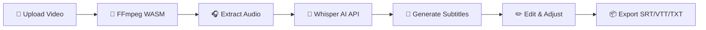

<div align="center">

# 🔥 SubForge

### *AI-Powered Subtitle Creator*


**Create professional subtitles from any video — entirely in your browser.**

[Live Demo](#-quick-start) · [Features](#-features) · [Get Started](#-quick-start) · [Contributing](#-contributing)

</div>

---

## ✨ Features

<div align="center">

| Feature | Description |
|---------|-------------|
| 🎥 **Drag & Drop Upload** | Drop MP4, WebM, MKV, or AVI files with instant preview |
| 🤖 **AI Transcription** | OpenAI Whisper-powered speech-to-text with 15+ language support |
| ▶️ **Live Video Preview** | Watch video with real-time subtitle overlay |
| ✏️ **Subtitle Editor** | Edit text, adjust timestamps, add/delete entries |
| 📦 **Multi-Format Export** | Download as SRT, VTT, or plain TXT |
| ⚙️ **Configurable** | Choose Whisper model size, language, bring your own API key |
| 🎨 **Premium Dark UI** | Glassmorphism design with smooth animations |
| 🔒 **100% Client-Side** | No server — video is processed in your browser |
| 📱 **Responsive** | Works on desktop, tablet, and mobile |

</div>

---

## 🚀 Quick Start

```bash
# Clone the repository
git clone https://github.com/deepakrajjs-29/mvp-subtitle-creater.git

# Navigate to project directory
cd mvp-subtitle-creater

# Open in browser (or use any local server)
start index.html
```

**Or simply download the files and open `index.html` in your browser!**

### Setup Your API Key

1. Go to [huggingface.co/settings/tokens](https://huggingface.co/settings/tokens)
2. Create a free account and generate an API token
3. Open SubForge → click ⚙️ Settings → paste your key → Save

---

## 💻 How It Works


```mermaid
graph LR
    A["📁 Upload Video"] --> B["🔧 FFmpeg WASM"]
    B --> C["🎧 Extract Audio"]
    C --> D["🤖 Whisper AI API"]
    D --> E["📝 Generate Subtitles"]
    E --> F["✏️ Edit & Adjust"]
    F --> G["📦 Export SRT/VTT/TXT"]
```

1. **Upload** — Drag & drop or browse for a video file
2. **Extract** — FFmpeg runs in-browser to extract audio as WAV
3. **Transcribe** — Audio is sent to HuggingFace's Whisper API
4. **Generate** — Text is split into timed subtitle entries
5. **Edit** — Fine-tune text and timestamps in the built-in editor
6. **Export** — Download as SRT, WebVTT, or plain text

---

## 🏗️ Project Structure

```
mvp-subtitle-creater/
│
├── 📄 index.html          # App structure & layout
├── 🎨 style.css           # Design system & all styles
├── ⚙️ script.js           # Application logic (modular)
└── 📖 README.md           # Documentation
```

### Architecture

| Module | Purpose |
|--------|---------|
| `Toast` | Non-intrusive notification system |
| `Settings` | localStorage-based config management |
| `SettingsModal` | API key, language, model configuration UI |
| `FileUploader` | Drag & drop handler with file validation |
| `VideoPlayer` | HTML5 video with live subtitle overlay |
| `TranscriptionEngine` | FFmpeg audio extraction + Whisper API with retries |
| `SubtitleParser` | Sentence segmentation + timestamp generation |
| `SubtitleEditor` | Full CRUD for subtitle entries |
| `ExportManager` | SRT, VTT, and TXT file generation |

---

## 🔧 Technologies

<div align="center">

| Technology | Purpose |
|------------|---------|
|  | Semantic structure |
|  | Glassmorphism design system |
|  | Modular application logic |
|  | In-browser audio extraction |
|  | Speech-to-text transcription |

</div>

---

## 🌍 Supported Languages

English, Spanish, French, German, Italian, Portuguese, Dutch, Japanese, Korean, Chinese, Russian, Arabic, Hindi, Tamil, Turkish — and more via Whisper's multilingual models.

---

## 🤝 Contributing

Contributions welcome! Here's how:

```bash
# Fork & clone
git clone https://github.com/YOUR_USERNAME/mvp-subtitle-creater.git

# Create feature branch
git checkout -b feature/awesome-feature

# Make changes & commit
git commit -m 'Add awesome feature'

# Push & open PR
git push origin feature/awesome-feature
```

---

## 📞 Contact

<div align="center">

### 👨‍💻 Deepak Raj

[](mailto:deepakrajjs2909@gmail.com)
[](https://github.com/deepakrajjs-29)

</div>

---

## 📄 License

MIT License · Copyright (c) 2025 Deepak Raj

---

<div align="center">

### ⭐ Star this repo if SubForge helped you! ⭐

**Made with ❤️ and 🔥 by Deepak Raj**

[🔝 Back to Top](#-subforge)

</div>
